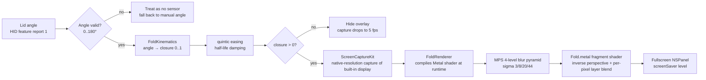

# RuiC-FoldScreen

**As you close your MacBook's lid, the desktop bends down with it.**

> **English fork** of [HRuiCcc/RuiC-FoldScreen](https://github.com/HRuiCcc/RuiC-FoldScreen) — UI strings and documentation translated to English. All credit for the original project belongs to the upstream author.

A small macOS menu bar app: it reads the laptop's built-in lid-angle sensor and projects the desktop through a real perspective fold — progressively blurred toward the top — until the screen goes dark. Free, open source, fully local.


> The clip above is real output (exported through the actual render pipeline, not a hand-drawn mockup): as the lid closes, the desktop bends with it — the top corners pull inward into a trapezoid, the image gets blurrier toward the top, and the hinge side stays perfectly sharp.

### Recorded on a real machine


This recording shows a **real desktop**, not a composite: this repository's page is open in the browser, and the whole page is bent and blurred in real time as the lid closes. Note how the file names at the top have melted into blur while `LICENSE`, `README.md`, and `build.sh` at the bottom stay crisp — that is the "blurrier toward the top" gradient.

Full-resolution original (1280×832, 4.8 s, no audio): [docs/fold-demo.mp4](docs/fold-demo.mp4)

> For privacy, the browser tab bar was blurred out during recording; the address visible in the frame is this repository's public URL.

Inspired by the open/close animations of folding phones and by [Bendy](https://trybendy.app/)'s public implementation of the effect. This project is an **independent from-scratch rewrite**, unaffiliated with Bendy or Apple.

### The three stages


Left to right: lid open (desktop untouched) → folded halfway → fully folded. The static image is sharper than the GIF so you can inspect the fold's edge detail.

---

## What it does

- **Follows the lid**: the lid angle drives the desktop bend in real time — fold as much as you close, not a canned animation
- **Three style presets**: Gauze (balanced) / Crease (hardest fold) / Frost (heaviest blur)
- **Three adjustable sliders**: perspective, blur, and shadow, plus a "fully open angle" threshold
- **Built-in preview**: a capture-free preview in Settings, so you can see the effect without screen recording permission
- **Restrained by design**: built-in display only; Escape pauses anytime; reconnects automatically after sleep or display changes
- **No network**: frames pass through memory for an instant — never written to disk, never uploaded, no audio

## Requirements

| Item | Requirement |
|---|---|
| System | macOS 14 or later |
| Hardware | Apple silicon MacBook (needs a lid-angle sensor) |
| Tested on | MacBook Air M4 (Mac16,12), macOS 26.5 |
| Building | Xcode command line tools only (**full Xcode not required**) |

Apple hasn't documented the lid sensor's report format, so some models can't read it. When that happens the app says so plainly, and you can still watch the effect through the preview in Settings.

## Build & run

```sh
./build.sh
open dist/RuiC-FoldScreen.app
```

On first launch, enable the app in *System Settings → Privacy & Security → Screen & System Audio Recording* — the effect must read the screen to bend it. Once granted, the app reconnects automatically; no need to toggle anything.

The build product is `dist/RuiC-FoldScreen.app`.

### About code signing (important)

The first time `build.sh` runs, it creates a self-signed certificate named **RuiC-FoldScreen Local Signing** in your login keychain and signs the app with it.

This is not busywork. TCC (macOS's permission database) records "who is authorized" as a **code requirement**:

- **Ad-hoc signing** (`codesign -s -`) produces a requirement pinned to the **binary hash**. Change one line of code and rebuild, the hash changes, macOS treats it as a different app — and the permission you granted **stops applying** until you re-authorize.
- **Certificate signing** pins the requirement to the **certificate itself** (`certificate root = H"3fbd…"`). Rebuilds change the hash but not the requirement, so the permission survives.

So if you ever see "I clearly granted permission but the app still says it has none", it is almost certainly a signing issue. Two commands to self-check:

```sh
# Should show certificate root = H"…"; if it shows cdhash = H"…" it is ad-hoc
codesign -d -r- dist/RuiC-FoldScreen.app

# Clears the confused TCC entry; the app asks again on next launch
tccutil reset ScreenCapture app.ruic.foldscreen
```

The certificate is valid only on this machine, is not issued by Apple, and **cannot be used for distribution** — that still requires a Developer ID.

### Permission-related behavior

Without permission, the app enters a waiting state and quietly polls `CGPreflightScreenCaptureAccess` — a read-only API that never touches the capture stack, so **no system prompt ever pops up**. The Settings page offers **Recheck** and **Reopen** buttons: the former re-checks immediately, the latter handles the case where macOS has recorded the permission but the current process hasn't picked it up (the system occasionally needs an app restart for this).

## Command line

The binary ships with a few headless entry points for verification and debugging:

```sh
BIN=dist/RuiC-FoldScreen.app/Contents/MacOS/RuiC-FoldScreen

$BIN --selftest                    # 23 self-checks: fold math, shader, sensor, offscreen render
$BIN --sensor                      # read the lid angle once
$BIN --render-frames out --hold .8 # export fold frames through the real pipeline for review
$BIN --scripted-lid                # run with scripted lid angles (no physical lid needed)
$BIN --smoke                       # bring up the full pipeline and write a diagnostic report after 3 s
```

`--render-frames` uses **exactly the same render pipeline as the overlay**, so what it exports is what the app actually displays — good for visual acceptance:

```sh
$BIN --render-frames out --size 1280x800 --steps 6 --preset 1
```

The demo GIF in this repository was produced with this entry point. The recipe (adjust resolution and steps freely):

```sh
# 1. Export one full "open → folded → open" cycle. --cycle keeps both ends at the
#    untouched desktop so looping never jumps; --no-grain removes the anti-banding
#    grain — it looks good on screen, but GIFs only have 256 colors, and the grain
#    quantizes into per-pixel flicker that kills inter-frame compression.
$BIN --render-frames frames --size 800x500 --steps 54 --cycle --no-grain

# 2. Assemble the GIF. bayer_scale=3 is the sweet spot: raising it to 5 saves
#    ~30% of the size, but large smooth gradients (like a moon halo) develop
#    visible concentric banding rings.
ffmpeg -y -framerate 18 -pattern_type glob -i 'frames/fold-*.png' \
  -vf "fps=18,scale=800:-1:flags=lanczos,split[s0][s1];\
[s0]palettegen=max_colors=128:stats_mode=diff[p];\
[s1][p]paletteuse=dither=bayer:bayer_scale=3:diff_mode=rectangle" \
  -loop 0 fold-demo.gif
```

## ⚙️ How it works



### Core pipeline notes

1. **Where the angle comes from**: the built-in sensor is an Apple-vendor HID device — usage page `0x20`, usage `0x8A` — reporting the angle as feature report 1, two little-endian bytes at offset 1. Read-only, non-exclusive, no drivers, no root. Out-of-range values are always discarded: better not to fold than to fold wrongly.

2. **How the angle becomes a fold**: `FoldKinematics` maps "degrees remaining to fully open" into `0..1` using a quintic smootherstep rather than cubic smoothstep — both start and end at rest, but the quintic curve has no acceleration discontinuity at the endpoints, so the desktop enters and exits the fold without a perceptible "clunk". Half-life damping then smooths frame-to-frame jitter (a half-life rather than a per-frame factor keeps the feel identical at any frame rate).

3. **The fold is computed, not drawn**: the screen is treated as a plane hinged along its bottom edge (the hinge) tipping backward with the lid, projected with real perspective, then normalized so both the top and bottom edges stay pinned — giving the forward map `d = s(1+k)/(1+sk)`. The shader needs the inverse, `s = d/(1+k(1−d))`. Horizontal contraction uses the same depth factor, so the top narrows while the hinge keeps full width — that's the trapezoid you see.

4. **Why the blur is layered**: running Gaussian blur per pixel is too expensive. Instead, each frame pre-computes four blur levels at quarter resolution with different sigmas, and the shader interpolates between neighboring levels based on each pixel's blur radius. The radius is proportional to distance from the viewer, so it concentrates at the top (`pow(h,3)`), keeping the middle readable and the bottom sharp. The radius is also scaled by closure, so the desktop regains clarity as the lid opens.

5. **Why it compiles without Xcode**: the Metal offline compiler ships with Xcode, not with the command line tools. Here the `.metal` file is embedded as a Swift string at build time and compiled on first launch via `MTLDevice.makeLibrary(source:)`. The whole toolchain is just `swiftc` plus the macOS SDK. The read-only build script `Tools/embed_shader.py` does the embedding, and the `.metal` file still gets normal syntax highlighting and diffs.

## Project structure

```
Shaders/Fold.metal              the fold shader (the only place to touch the look)
Sources/FoldScreen/
  Core/FoldKinematics.swift     pure math: closure curve, damping, perspective projection
  Core/LidAngle.swift           sensor seam + HID implementation + scripted implementation
  Core/FoldSettings.swift       settings value types, presets, shader uniform assembly
  Core/LiveFold.swift           orchestrator: state machine, frame loop, system events
  Capture/DesktopMirror.swift   ScreenCaptureKit capture + still-frame implementation
  Render/FoldRenderer.swift     Metal pipeline, blur pyramid, offscreen snapshots
  Render/OverlaySurface.swift   fullscreen overlay window
  Render/PreviewArtwork.swift   artwork for the Settings preview (drawn in code)
  UI/                           menu bar, settings window, preview
  Support/                      hotkey, login item, headless self-check
Tools/embed_shader.py           embeds the shader into the binary
Tools/MakeIcon.swift            draws the app icon in code
build.sh                        the only build entry point
```

## Known limitations

- Built-in display only; external monitors are not touched
- The lid sensor is undocumented; other models may not be able to read it
- Escape is a global hotkey, captured while the effect is visible
- Not notarized; the first launch may require approval in Privacy & Security

## License

[MIT](LICENSE). The earliest public implementation of the folding-desktop idea is [Bendy](https://trybendy.app/); this project is an independent rewrite, unaffiliated with Bendy or Apple.

---

## Support the original author

<p align="center">
  
</p>

<p align="center">Scan with WeChat to thank the upstream author</p>
